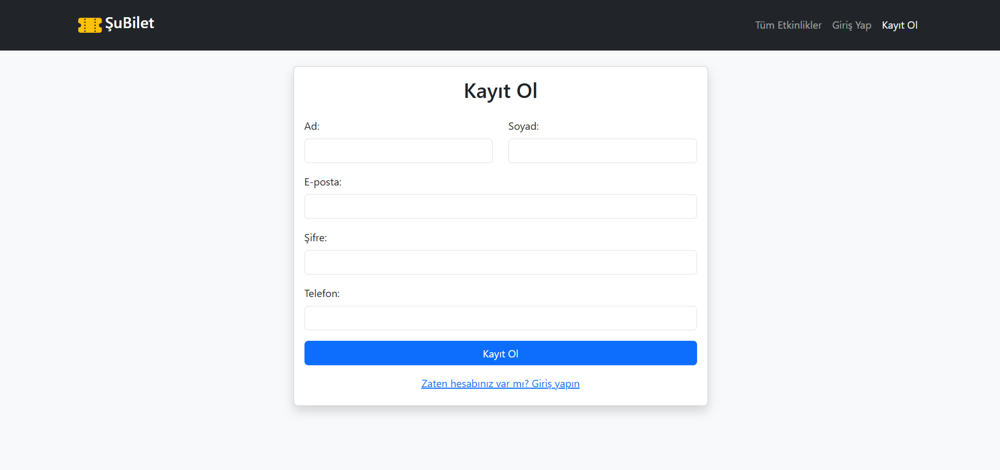
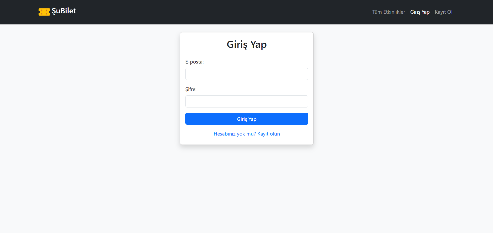
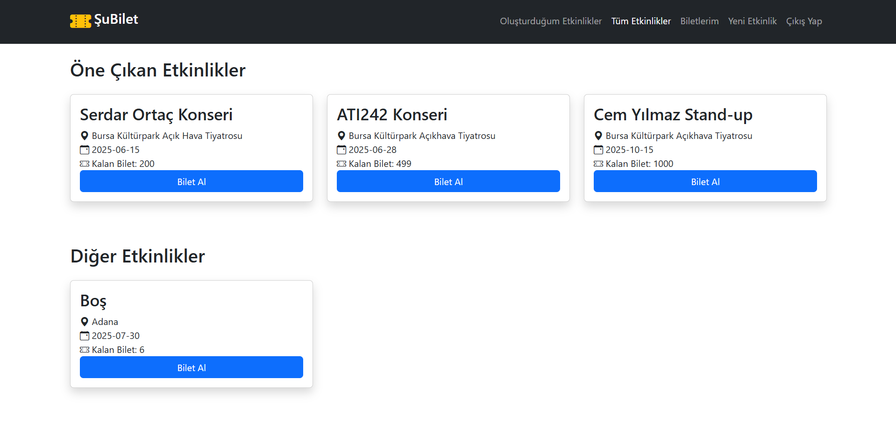
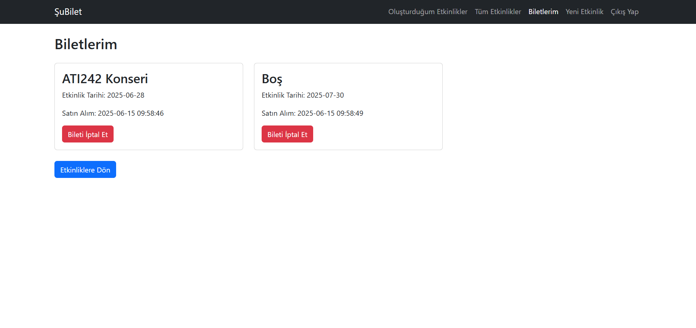

# ŞuBilet - Etkinlik ve Bilet Yönetim Sistemi

## 📋 Proje Hakkında

ŞuBilet, etkinliklerin oluşturulması, yönetilmesi ve biletlerin satın alınması için tasarlanmış modern bir web uygulamasıdır. Kullanıcı dostu arayüzü ve güvenli altyapısı ile etkinlik organizatörleri ve katılımcılar için kapsamlı bir platform sunar.


[Siteyi canlı denemek için tıklayabilirsiniz](http://95.130.171.20/~st23360859058/index.php)

[Youtube demo videosunu izlemek için tıklayabilirsiniz](https://www.youtube.com/watch?v=Sj8bnFOPHZA)


## 🚀 Özellikler

- **Etkinlik Yönetimi**
  - Etkinlik oluşturma, düzenleme ve silme
  - Öne çıkan etkinlikler 
  - Detaylı etkinlik bilgileri 
  
- **Bilet İşlemleri**
  - Güvenli bilet satın alma
  - Bilet iptal etme
  - Bilet geçmişi görüntüleme
  
- **Kullanıcı Sistemi**
  - Güvenli kayıt ve giriş
  - Kişisel etkinlik yönetimi

## 🛠 Teknolojiler

- **Frontend**: HTML5, CSS3, Bootstrap 5
- **Backend**: PHP 8
- **Veritabanı**: MySQL
- **Güvenlik**: Session yönetimi, SQL injection koruması
- **Responsive Tasarım**: Tüm cihazlara uyumlu arayüz

## 📊 Veritabanı Tabloları


```sql
-- Users Tablosu
CREATE TABLE users (
    id INT AUTO_INCREMENT PRIMARY KEY,
    username VARCHAR(50) NOT NULL UNIQUE,
    email VARCHAR(100) NOT NULL UNIQUE,
    password_hash VARCHAR(255) NOT NULL,
    created_at DATETIME DEFAULT CURRENT_TIMESTAMP,
    first_name VARCHAR(50),
    last_name VARCHAR(50),
    phone VARCHAR(20)
);

-- Events Tablosu
CREATE TABLE events (
    id INT AUTO_INCREMENT PRIMARY KEY,
    title VARCHAR(255) NOT NULL,
    location VARCHAR(255) NOT NULL,
    event_date DATE NOT NULL,
    total_tickets INT NOT NULL,
    available_tickets INT NOT NULL,
    created_at DATETIME DEFAULT CURRENT_TIMESTAMP,
    user_id INT NOT NULL
);
-- Varsayılan Etkinlikler
INSERT INTO events (id, title, location, event_date, total_tickets, available_tickets, created_at, user_id)
VALUES
(1, 'ATI242 Konseri', 'Bursa Kültürpark Açıkhava Tiyatrosu', '2025-06-28', 500, 499, '2025-06-14 14:11:31', 1),
(2, 'Cem Yılmaz Stand-up', 'Bursa Kültürpark Açıkhava Tiyatrosu', '2025-10-15', 1000, 1000, '2025-06-14 14:11:31', 1),
(3, 'Serdar Ortaç Konseri', 'Bursa Kültürpark Açık Hava Tiyatrosu', '2025-06-15', 200, 200, '2025-06-14 14:11:31', 1);

-- Tickets Tablosu
CREATE TABLE tickets (
    id INT AUTO_INCREMENT PRIMARY KEY,
    user_id INT NOT NULL,
    event_id INT NOT NULL,
    purchase_date DATETIME DEFAULT CURRENT_TIMESTAMP,
    
    FOREIGN KEY (user_id) REFERENCES users(id) ON DELETE CASCADE,
    FOREIGN KEY (event_id) REFERENCES events(id) ON DELETE CASCADE
);

```

## Ekran Görüntüleri


Kayıt Olma Ekranı



Giriş Yapma Ekranı



Yeni Etkinlik Oluşturma


Tüm Etkinlikler



Biletlerim




## 🔒 Güvenlik

- SQL injection koruması
- XSS (Cross-site scripting) önleme
- Güvenli şifre hash'leme
- Oturum güvenliği
- Rol tabanlı erişim kontrolü


## 💡 Kullanım

1. Kayıt olun veya giriş yapın
2. Etkinlik oluşturmak için "Yeni Etkinlik" sayfasını kullanın
3. Etkinlikleri görüntülemek için ana sayfayı ziyaret edin
4. Bilet satın almak için "Tüm Etkinliklere" gidin veya ana sayfadan da alabilirsiniz
5. "Biletlerim" sayfasından bilet geçmişinizi görüntüleyin, isterseniz iptal edin

